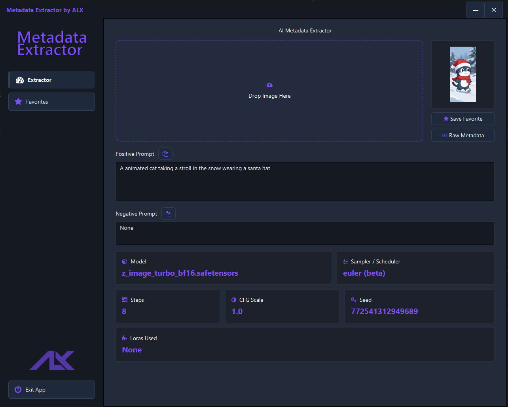
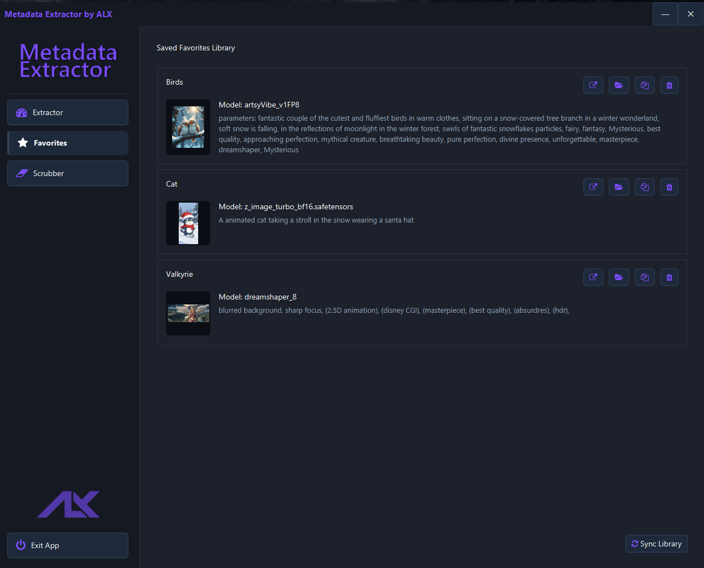
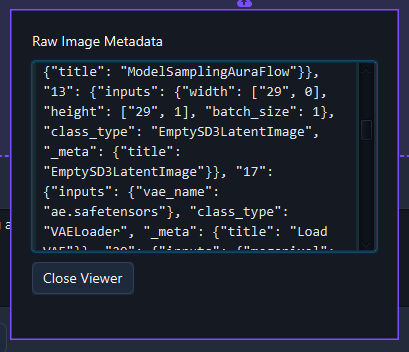
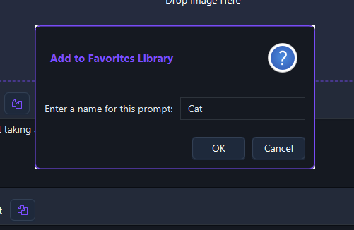

# AI Metadata Viewer & Extractor


A high-performance JavaFX desktop application designed to unify generation metadata across the fragmented AI image generation ecosystem. It provides instant extraction, private local persistence, and deep-node inspection for professional artists and developers.

---

## 📸 Interface

| Extractor Portal | Favorites Library |
|:---:|:---:|
|  |  |
| *Drag & Drop Extraction* | *Persistent Card-Based Library* |

<details>
<summary><b>View Advanced Features</b></summary>
<br>

| Raw JSON Viewer | Save to Favorites |
|:---:|:---:|
|  |  |
| *Deep Inspection for Complex Graphs* | *Themed Undecorated Dialogs* |

</details>

---

## ✨ Key Features

* **Universal Compatibility:** Full support for **ComfyUI**, **SwarmUI**, **A1111**, **Forge**, **Reforge**, **Forge Neo**, and **SD-Matrix**.
* **Deep-Recursive Parsing:** Aggressive extraction engine that identifies models, samplers, and prompts buried within complex, nested JSON node graphs.
* **Privacy-First Persistence:** All generation data and thumbnails are stored locally in human-readable JSON; your workflows never leave your machine.
* **Developer-Centric UI:** A custom-coded "Obsidian & Indigo" theme featuring a **Raw Metadata Inspector** for debugging non-standard node outputs.
* **Lightweight Performance:** Programmatic JavaFX (No FXML) ensures near-instant launch times and zero-lag image processing.

---

## 🛠️ Technical Architecture

The application implements a **Model-View-Service** (MVS) architecture to decouple business logic from the interface.

* **Singleton Pattern:** Thread-safe global access to image registries.
* **Recursive Strategy:** Adaptive parsing that navigates nested node structures found in ComfyUI and SwarmUI.
* **Reactive Binding:** JavaFX properties ensure real-time UI updates and responsive text wrapping.
* **Technology Stack:** Java 8 (Liberica JDK Full), Jackson (JSON Serialization), Metadata Extractor (Drew Noakes), Ikonli (FontAwesome).

---

## 🚀 Getting Started

1.  **Clone the repository**.

2.  **Build with Maven:**
    ```bash
    mvn clean install
    ```
3.  **Run:**
    ```bash
    mvn javafx:run
    ```

---

## 📜 License

Distributed under the **MIT License**. Free for personal and commercial use.

---

## 💖 Support the Project

If the **AI Metadata Viewer** has streamlined your workflow, consider supporting its ongoing development. Your contributions help maintain compatibility with new AI platforms and node structures.

[](https://github.com/sponsors/erroralex)
[](https://ko-fi.com/error_alex)

---

<p align="center">
  <b>Developed by</b><br>
  <br>
  Copyright (c) 2025 Alexander Nilsson
</p>
