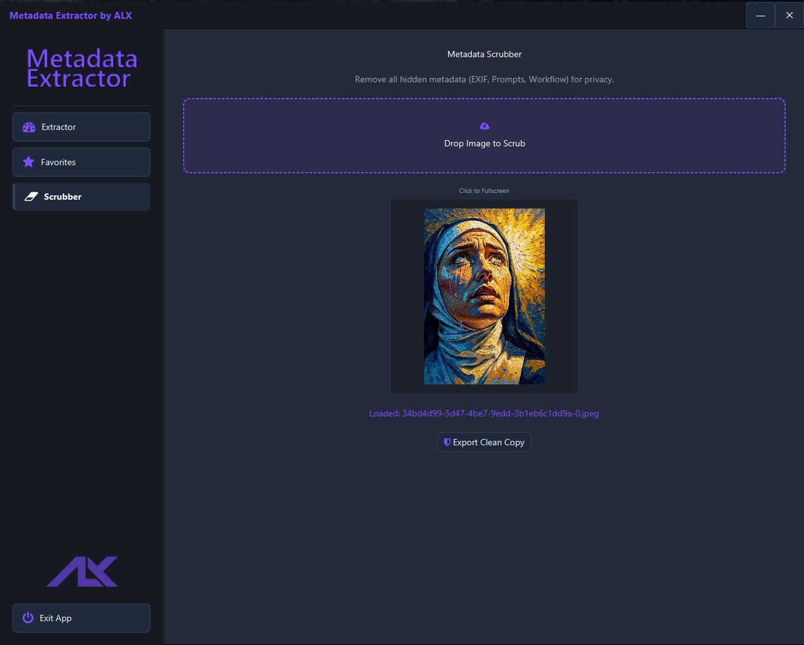

# AI Metadata Viewer & Extractor


A high-performance JavaFX desktop application designed to unify generation metadata across the fragmented AI image generation ecosystem. It provides instant extraction, **privacy scrubbing**, private local persistence, and deep-node inspection for professional artists and developers.

---

## 📸 Interface

### Core Workflow
| Extractor Portal | Favorites Library |
|:---:|:---:|
|  |  |
| *Drag & Drop Extraction & Fullscreen Preview* | *Persistent Card-Based Library* |

### Privacy Tools
| Metadata Scrubber |
|:---:|
|  |
| *Strip EXIF/PNG chunks and export clean copies* |

<details>
<summary><b>View Advanced Features</b></summary>
<br>

| Raw JSON Viewer | Save to Favorites |
|:---:|:---:|
|  |  |
| *Deep Inspection for Complex Graphs* | *Themed Undecorated Dialogs* |

</details>

---

## ✨ Key Features

* **Universal Compatibility:** Intelligent parsing for **ComfyUI** (API & Workflow), **SwarmUI**, **A1111**, **Forge**, **InvokeAI**, **NovelAI**, and **SD-Matrix**.
* **Metadata Scrubbing:** A dedicated view to strip all hidden metadata (Prompts, Workflow, EXIF) and export clean images for safe sharing.
* **Smart Parsing Engine:**
    * **Content-Aware Detection:** Distinguishes between API execution blocks and visual workflow graphs to prevent "N/A" errors.
    * **Deep Recursion:** Identifies custom nodes (e.g., *Power LoRA Loader*), resolution inputs, and nested JSON structures.
    * **Physical Fallback:** Reads physical file headers to guarantee valid image dimensions even when metadata is missing.
* **High-Fidelity Persistence:** Saving a favorite now creates a **full-quality copy** of the original image, preserving 100% of the metadata and pixels in your local library.
* **Interactive UI:**
    * **Fullscreen Preview:** Click any thumbnail (Extractor or Scrubber) for a modal, high-res inspection view.
    * **Raw Inspector:** Debug non-standard outputs with a syntax-highlighted JSON viewer.
* **Lightweight Performance:** Programmatic JavaFX (No FXML) ensures near-instant launch times and zero-lag image processing.

---

## 🛠️ Technical Architecture

The application implements a **Model-View-Service** (MVS) architecture to decouple business logic from the interface.

* **Singleton Pattern:** Thread-safe global access to image registries and persistent views.
* **Heuristic Strategy Pattern:** Adaptive parsing strategies that score metadata chunks to select the most relevant generation data.
* **Reactive Binding:** JavaFX properties ensure real-time UI updates and responsive text wrapping.
* **Technology Stack:** Java 8 (Liberica JDK Full), Jackson (JSON Serialization), Metadata Extractor (Drew Noakes), Ikonli (FontAwesome).

---

## 🚀 Getting Started

1.  **Clone the repository**.

2.  **Build with Maven:**
    ```bash
    mvn clean install
    ```
3.  **Run:**
    ```bash
    mvn javafx:run
    ```

---

## 📜 License

Distributed under the **MIT License**. Free for personal and commercial use.

---

## 💖 Support the Project

If the **AI Metadata Viewer** has streamlined your workflow, consider supporting its ongoing development. Your contributions help maintain compatibility with new AI platforms and node structures.

[](https://github.com/sponsors/erroralex)
[](https://ko-fi.com/error_alex)

---

<p align="center">
  <b>Developed by</b><br>
  <br>
  Copyright (c) 2025 Alexander Nilsson
</p>
