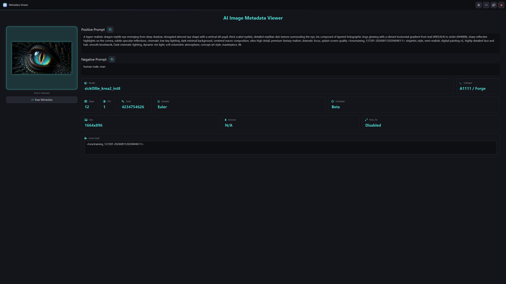
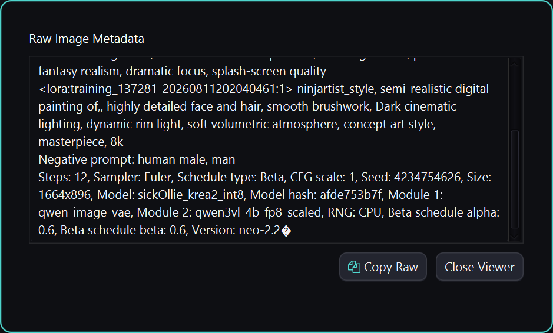

  

# AI Metadata Viewer & Extractor

A high-performance JavaFX desktop application designed to inspect and extract generation metadata across the AI image generation ecosystem. It provides instant extraction, deep ComfyUI node-graph inspection, and raw metadata inspection for artists and developers.

> [!NOTE]
> Favorites Library, Metadata Scrubber, and Speed Sorter have moved to [Latent Library](https://github.com/erroralex). MetaDataViewer is now focused purely as a lightweight, fast, single-screen extractor utility.

---

## 📸 Interface

  
   
  <i>Single-screen extractor: drop an image and every generation field populates instantly.</i>

  
   
  <i><b>Raw Metadata:</b> full unparsed output for non-standard or unrecognized sources, with one-click copy.</i>

---

## ✨ Key Features

* **Universal Compatibility:** Intelligent parsing for **ComfyUI** (API & Workflow graphs), **SwarmUI**, **Automatic1111 / Forge**, **InvokeAI**, and **NovelAI**.
* **Advanced ComfyUI Engine:**
  * **Graph Traversal:** Resolves connected prompts, samplers, schedulers, models, and LoRAs across complex execution flows.
  * **Custom Node Support:** Recursively extracts parameters from advanced custom nodes (Power LoRA Loaders, KSampler variations, reroutes).
  * **Extended Field Discovery:** Surfaces Scheduler, Denoise, and Hires. fix as dedicated fields; Distilled CFG (flux-guidance) is folded into the CFG field. Model Hash and ControlNet are A1111/Forge-only today — still captured, but only visible via the Raw Metadata inspector for other sources.
* **Physical Fallback:** Reads physical image headers to guarantee valid image dimensions and file size even when metadata is missing or malformed.
* **Latent Design System:** Clean, modern dark UI styled against the Latent ecosystem's token specifications — shadows, gradients, and type scale included.
* **Interactive UI:**
  * **Drag & Drop:** Drop any PNG, JPG, JPEG, or WEBP directly onto the image preview for instant extraction — even to replace an image that's already loaded.
  * **Fullscreen Preview:** Click any image for a modal, high-res inspection view.
  * **Raw Inspector:** Debug non-standard outputs with a raw text/JSON inspection modal, with one-click copy.
  * **Copy Feedback:** Prompt and raw-metadata copy actions confirm with a toast instead of a silent clipboard write.
  * **Responsive Layout:** The metadata panel reflows underneath the image on narrower windows instead of clipping, and stat cards wrap to fit. Prompt boxes grow to fit their content, up to a cap, then scroll internally.
* **Lightweight & Cross-Platform:** Programmatic JavaFX (No FXML) with zero startup lag and cross-platform build support.

---

## 🛠️ Technical Architecture

* **Strategy Pattern:** Tool-specific parsing strategies (`ComfyUIStrategy`, `CommonStrategy`, `SwarmUIStrategy`, `InvokeAIStrategy`, `NovelAIStrategy`) with heuristic chunk scoring.
* **Stateless & Portable:** Zero background database or config locking — drop and inspect with zero setup overhead.
* **Technology Stack:** Java 21, JavaFX 21, Jackson, metadata-extractor (Drew Noakes), Ikonli (FontAwesome), SLF4J, JUnit 5.

---

## 🚀 Getting Started

Grab the latest standalone build for your OS from the [Releases](https://github.com/erroralex/Metadata-Viewer/releases) page — no Java installation required.

* **Windows:** download the `MetadataViewer-windows-<version>.exe` asset and run it directly — it's a single self-contained file.
* **macOS / Linux:** download the `.zip` for your OS, extract it (a real "Extract All", not just browsing into the zip), and run the app from inside the extracted folder.

Building from source instead? See [CONTRIBUTING.md](CONTRIBUTING.md).

---

## 📜 License

Distributed under the **MIT License with Commons Clause** — see [LICENSE.md](LICENSE.md). Free to use, modify, and distribute; the Commons Clause condition means you can't sell the Software itself (e.g. as a hosted or paid service).

---

## 💖 Support the Project

If **AI Metadata Viewer** has streamlined your workflow, consider supporting its ongoing development.

---

  <b>Developed by</b> 
   
  Copyright (c) 2025-2026 Alexander Nilsson

